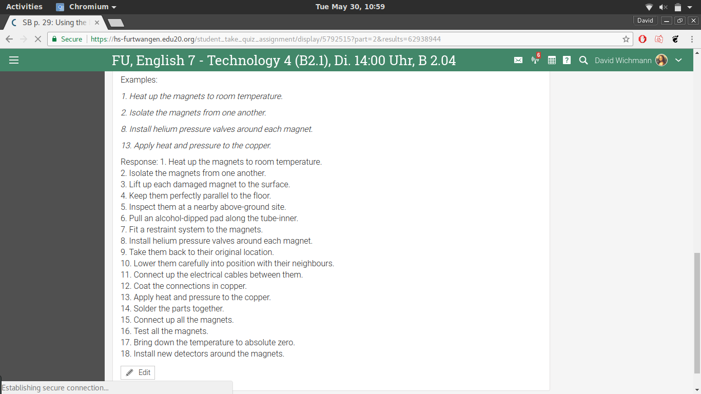

# Einkaufsliste
## OSSW Uebung 4

1. Mein Name ist **David Wichmann**
1. Dieses Projekt ist Teil meiner Vorlesung *Open-source basierte Softwareentwicklung*

1. Ich studiere an der Hochschule Furtwangen
	1. Abkürzung: HFU
	1. Ort: Furtwangen im Schwarzwald

Unsere Aufgabe lautet:

> In die Datei README.md erstellen Sie einen kurzen Lebenslauf von sich (...).
> Verwenden Sie die Markdown-Syntax und gestalten Sie die Seite mit verschiedenen Elementen der Markdown-Sprache

Bild:
